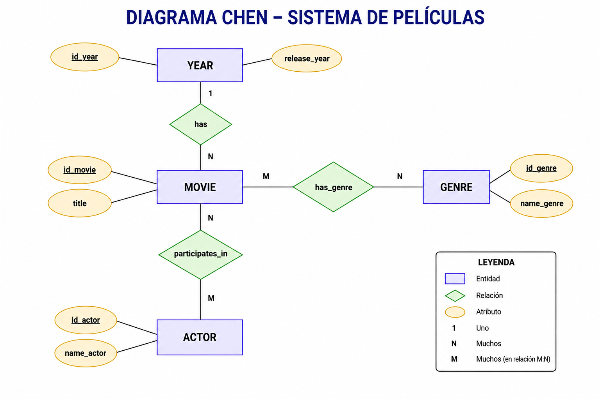
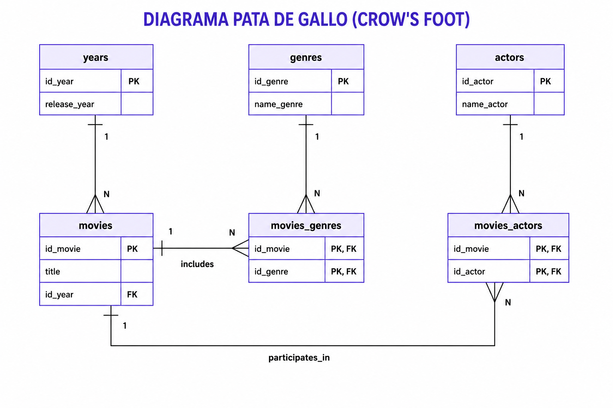

# API Movies

Proyecto del bootcamp de Factoria F5 cuyo objetivo es crear una API REST para
gestionar películas.

## Requisitos

La API deberá incluir los siguientes endpoints:

1. Obtener todas las películas.
2. Obtener una película por su identificador (`id`).
3. Añadir una película.
4. Actualizar los datos de una película.
5. Eliminar una película.
6. Crear un sexto endpoint para poder recuperar una película mediante su título o género (recuerda ... findBy)
7. Crear las tablas extras con las respectivas relaciones : género, años y actores

## Modelado de datos

El proyecto debe incluir:

- Un diagrama de Chen.
- Un diagrama de patas de gallo.
- Las tablas de películas, géneros, años y actores.
- Las relaciones entre las entidades, correctamente definidas.

## Tecnologías

- Maven
- Java 21
- Spring Boot

## Analysis previa

Tenemos 4 entidades principales: `movie`, `genre`, `year` y `actor`.

### Relaciones

- **Movie N:M Genre**: una película puede tener varios géneros y un género puede clasificar muchas películas.
- **Year 1:N Movie**: un año puede tener muchas películas, pero cada película pertenece a un solo año.
- **Movie N:M Actor**: una película puede contar con varios actores y un actor puede participar en muchas películas.

### Tablas

| Tabla | Descripción |
|--------|-------------|
| `movies` | Información de las películas. |
| `genres` | Catálogo de géneros cinematográficos. |
| `years` | Años de lanzamiento de las películas. |
| `actors` | Catálogo de actores. |
| `movies_genres` | Tabla intermedia para la relación N:M entre películas y géneros. |
| `movies_actors` | Tabla intermedia para la relación N:M entre películas y actores. |

### Chen Diagram

### Crow's Foot Diagram

